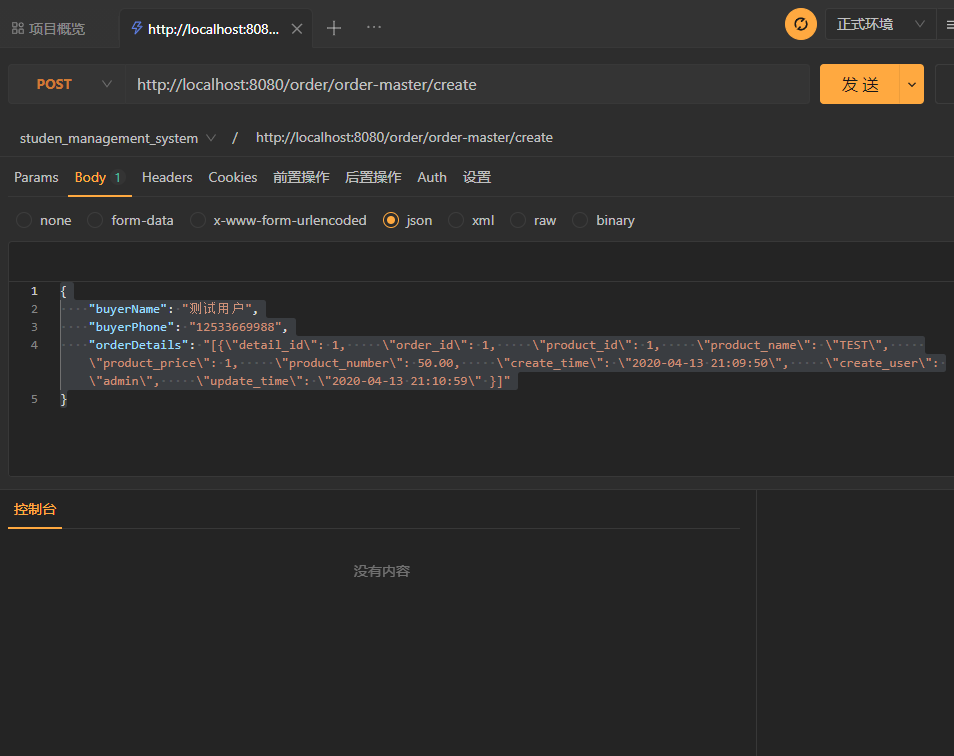

# 工程简介

# 延伸阅读

spring boot  事物学习

https://blog.csdn.net/u013919153/article/details/116045229

https://blog.csdn.net/weixin_44141870/article/details/116048223

https://bugpool.blog.csdn.net/article/details/105622751?spm=1001.2101.3001.6650.1&utm_medium=distribute.pc_relevant.none-task-blog-2%7Edefault%7ECTRLIST%7ERate-1-105622751-blog-116048223.t5_download_50w&depth_1-utm_source=distribute.pc_relevant.none-task-blog-2%7Edefault%7ECTRLIST%7ERate-1-105622751-blog-116048223.t5_download_50w&utm_relevant_index=2

https://bugpool.blog.csdn.net/article/details/105591011

body入参数如下：
{
"buyerName": "测试用户",
"buyerPhone": "12533669988",
"orderDetails": "[{\"detail_id\": 1,     \"order_id\": 1,     \"product_id\": 1,     \"product_name\": \"TEST\",     \"product_price\": 1,     \"product_number\": 50.00,     \"create_time\": \"2020-04-13 21:09:50\",     \"create_user\": \"admin\",     \"update_time\": \"2020-04-13 21:10:59\" }]"
}